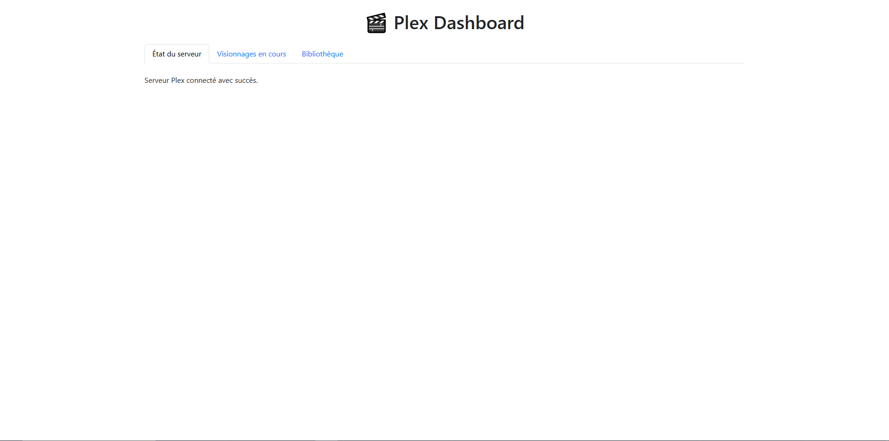

# 🎬 Plex Dashboard Web

Interface web responsive pour visualiser l'état de votre serveur Plex, les utilisateurs en cours de visionnage, et explorer votre bibliothèque.


---

## 📸 Aperçu



---

## 🧭 Sommaire

- [🚀 Fonctionnalités](#-fonctionnalités)
- [⚙️ Installation](#️-installation)
- [🔐 Configuration](#-configuration)
- [🖥 Utilisation](#-utilisation)

---

## 🚀 Fonctionnalités

- ✅ Affichage de l'état du serveur Plex
- 🎥 Liste des utilisateurs en cours de visionnage (nom, média, timestamp, IP)
- 📚 Accès à la bibliothèque Plex (films, séries, jaquettes)
- 🌐 Interface web responsive et moderne (Bootstrap 5)
- 🔄 Données mises à jour automatiquement côté client

---

## ⚙️ Installation


1. Installer les dépendances
```
npm install express dotenv axios path
```

2. Configuration

Crée un fichier ```.env``` à la racine du projet:
```env

PLEX_URL=localhost:32400
PLEX_TOKEN=VOTRE TOKEN PLEX
```
* Accédez ensuite à public/js/script.js et remplacez également VOTRE TOKEN PLEX par votre token

2.1 Obtenir le ```PLEX_TOKEN```

* Accédez à  ```fdp.js``` (¬‿¬)
* Puis mettez votre EMAIL et MOT DE PASSE plex.
* Exécutez le script
* Récupérez votre token.


## 🖥 Utilisation

* Onglet **état**: Indique si le serveur est joignable
* Onglet **visionnage**: liste des utilisateurs et contenus en cours
* Onglet **Bibliothèque** : jaquettes et titres des films/séries


